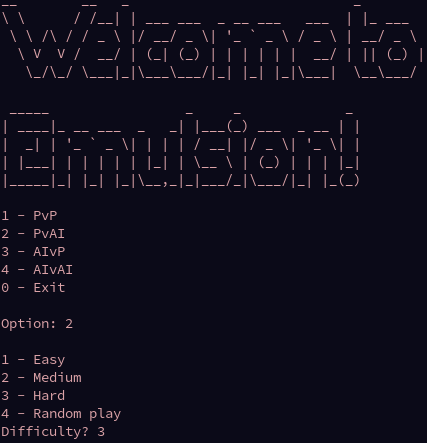
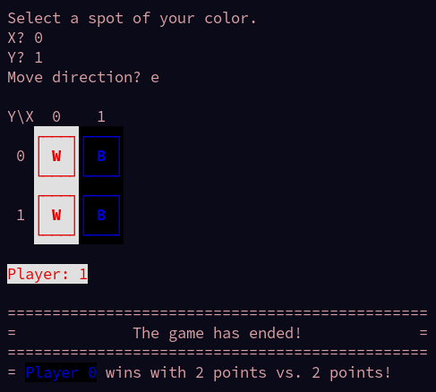

# PLOG TP1 RI - T3 Emulsion_1

## Identificação dos elementos do grupo

- João de Jesus Costa - up201806560
- João Lucas Silva Martins - up201806436

## Instalação e execução

Para correr o jogo, é apenas necessário consultar o ficheiro `PLOG_TP1_RI_T3_Emulsion_1.pl`
e, em seguida, chamar o predicado `play/0`.

```pl
consult('PLOG_TP1_RI_T3_Emulsion_1.pl').
play.
```

### Notas sobre cores e fontes

O nosso programa usa os códigos de escape _ANSI_ para definir/alterar as cores
do terminal, tanto do _background_, como do _foreground_. É possível que
alguns emuladores de terminais não reconheçam estes códigos e não mostrem as
diferentes cores.

É necessário o uso de uma fonte com suporte para caracteres **UTF-8**. No
caso do _sicstus_ no **Windows**, recomendámos a fonte **consolas**.

## Descrição do jogo

[Sítio onde obtemos esta informação.](https://boardgamegeek.com/boardgame/311851/emulsion)

**Emulsion** é um jogo de tabuleiro para dois jogadores.  
O tabuleiro está organizado em quadrículas (**peças**) de duas cores distintas
(originalmente preto e branco). Este tabuleiro tem tamanho **NxN**, sendo que
**N** é um qualquer número inteiro. No ínicio do jogo, as **peças** estão
organizadas um padrão em xadrez.

- O **valor** de uma peça é o número de peças ortogonalmente adjacentes a essa
  mais metade do número de limites do tabuleiro adjacentes.

- O **grupo** de uma peça é o conjunto de todas as peças a que podemos chegar
  através de movimentos ortogonais entre peças adjacentes.

- O **tamanho de um grupo** é o número de peças nele.

- A **pontuação de um jogador** é o tamanho do seu maior grupo.

O jogador com as **peças pretas** joga primeiro. Após cada jogada, passámos ao
turno do outro jogador.  
Durante o seu turno, um jogador pode trocar a posição de um par de peças de
cores diferentes ortogonal ou diagonalmente adjacentes de modo a aumentar
o **valor** da **peça** da sua cor nesse par.

O jogo termina quando já não existem mais jogadas disponíveis. O vencedor
é o jogador com maior **pontuação**.  
Em caso de empate, somamos sucessivamente às pontuações o valor do segundo,
terceiro, e por aí em diante maiores grupos de cada jogador até o empate
ser resolvido.  
Em tabuleiros com tamanho par (N par), é possível que haja um empate mesmo
depois da soma dos menores grupos. Nestes casos, o jogador que fez a última
jogada sai vitorioso.

## Lógica do jogo

### Representação interna do estado do jogo

O estado do jogo, `GameState` é constituído pelos seguintes:

- O tabuleiro é representado internamente como uma lista de listas (**NxN**).
  Cada uma das listas internas representa uma linha do tabuleiro. As peças são
  representadas pelos números **0 e 1**, sendo 0 as peças pretas e 1 as peças
  brancas.
- Tamanho **N** do tabuleiro (calculado quando um tabuleiro é escolhido).
- As opções de jogo escolhidas no menu (_Player_ ou _AI_ e seu nível) são
  representas por uma lista com dois números. O primeiro refere o jogador 0 (preto)
  e o segundo o jogador 1 (branco). Estes números podem ter um dos seguintes
  significados:
  - 0 -> player;
  - 1 -> easy AI;
  - 2 -> medium AI;
  - 3 -> hard AI;
  - 4 -> random AI.
- O jogador atual é representado pelos números **0 e 1**, com o mesmo significado
  das peças com a mesma identificação.

### Visualização do estado do jogo

Como o jogador 0 (peças pretas) é sempre o primeiro a jogar, o estado de jogo
inicial (com o tabuleiro) é representado da seguinte forma:


Existem dois predicados para facilitar o _input_ e seu processamento:
`input(+Prompt, -Input)` e `inputNum(+Prompt, -Input)`. Estes predicados permitem
a leitura de _input_ dos jogadores sem um ponto (**.**) no fim. Além disso, linhas
com espaços também podem ser lidas sem o uso de aspas.  
Estes predicados são usados sempre que é necessário obter _input_ do utilizador.
Todo o _input_ lido passa por um processo de validação e o jogador é informado
quando o seu _input_ for considerado inválido, tendo assim a possibilidade de
o corrigir.

A aplicação possui um sistema de _menus_ para escolha do modo de jogo e, caso seja
necessário, escolha da dificuldade/nível do _AI_. Na seguinte imagem, podemos
ver um exemplo de interação de um jogador com o _menu_.



### Lista de jogadas válidas

A lista de jogadas válidas é obtida com predicado

```pl
valid_moves(+GameState, +Player, -ListOfMoves) :-
  setof(Move, valid_move_full(GameState, Player, Move), ListOfMoves).
```

Este predicado gera todos os movimentos possíveis através do uso de `setof`
e `valid_move_full/3`.  O predicado `valid_move_full(GameState, Player, [P1, P2])`
verifica se uma jogada é válida (mover peça `P1` para `P2`) para um dado jogador
(`Player`) e estado de jogo (`GameState`). Para tal, é verificado que as duas
peças envolvidas são de jogadores diferentes, são adjacentes, e que, a peça `P1`
aumenta de valor após ser deslocado para a posição `P2`.

Nota: um movimento/jogado, `Move`, é uma lista contendo um par de coordenadas.
O movimento consiste em trocar as posições das peças no par de coordenadas, por
exemplo, `[[0, 0], [1, 1]]`.

### Execução de jogadas

As jogadas são do utilizador são lidas com o predicado
`choose_move(+GameState, +Player, +Level, -Move)`. Este predicado é também usado
para gerar uma jogada do _AI_ (discutida mais em _Jogada do computador_). Para
ler uma jogada do utilizador, o `Level` deve ser 0 (correspondendo assim às
opções de jogo descritas atrás para _player_).

O jogador insere as coordenadas da peça sobre a qual quer jogar (**X** e **Y**
pertencentes a **[0, N[**) e uma direção: **n**, **nw**, **w**, **sw**, **s**,
**se**, **e** ou **ne**.


Uma jogada é considerada válida quando a peça selecionada é do jogador em questão
(da sua cor) e a direção escolhida resulta numa troca com uma peça do outro
jogador (cor oposta). Para além disto, a troca tem de causar um aumento no
**valor** da peça em questão.

### Final do jogo

A verificação e tratamento da situação de final de jogo é feita pelo predicado
`game_over(+GameState, -Winner)`.

Este predicado começa por verificar se o jogador atual ainda tem jogadas válidas
disponíveis. Para isso, faz uso do predicado `valid_moves/3` (discutido
anteriormente). No caso de já não existirem jogadas válidas, obtém a pontuação
de cada jogador e verifica qual é o vencedor, mostrando esta informação ao
utilizador e, em seguida, voltando ao _menu_ principal.

Exemplo de ecrã de vitória para o jogador 0:



### Avaliação do tabuleiro

A avaliação do tabuleiro é feita através do predicado
`value(+GameState, +Player, -Value)`. Value é uma lista ordenada do tamanho de todos os
grupos de um dado player, gerados pelo predicado `getAllGroups(GameState, Player, Groups)`.
O predicado `getAllGroups` por sua vez gera um conjunto de peças controladas pelo Player e
através da chamada de `get_all_adjacent` obtém o grupo de cada peça.

### Jogada do computador

A jogada a efetuar pelo computador é gerada pelo predicado
`ai_getBestMove(+GameState, +Player, +Moves, +Level, -BestMove, -Val)`,
chamado por `choose_move(+GameState, +Player, +Level, -Move)`. O valor de `Level`
em `ai_getBestMove` representa o número de jogadas subsequentes que a _AI_ vai
analisar, ou seja, a profundidade da árvore de pesquisa que irá ser gerada ao
longo do predicado. Este valor está relacionado com o nível de dificuldade
escolhido no início do jogo. Maior dificuldade implicada um valor maior para
`Level`.

Quando o `Level` a analisar é 1, o predicado `ai_getBestMove` resume-se a retornar,
do conjunto de movimentos dado, _Moves_, aquele que mais contribui para a pontuação
do _AI_.

Para `Level > 1`, o predicado `ai_getBestMove` gera a melhor jogada com `Level` 1
que o inimigo pode fazer, executa-la, e de seguida gera um novo conjunto de jogadas
válidas com o novo estado do tabuleiro. Posteriormente, chama recursivamente o
predicado com as novas jogadas possíveis geradas e o novo tabuleiro, com `Level`
decrescido de 1. Este conjunto de regras é responsável por construir um novo ramo
com uma nova árvore com profundidade `Level - 1`. Por último, é usado o melhor
valor obtido proveniente da chamada recursiva feita anteriormente para comparar
com os restantes movimentos dados, feita a escolha do movimento que maximiza o
valor nos ramos final da árvore.

É de notar que, caso a geração de novos movimentos falha quando não existem
novos movimentos possíveis. Neste caso, o predicado `ai_getBestMove` calcula o
vencedor e maximiza o valor do movimento da _AI_. Caso contrário, minimiza o
valor do movimento de forma a ser a última escolha da _AI_.

## Conclusões

## Bibliografia

[SICStus Prolog](https://sicstus.sics.se/sicstus/docs/latest4/html/sicstus/)

[SWI-Prolog PlDoc](https://www.swi-prolog.org/pldoc/doc_for?object=manual)
